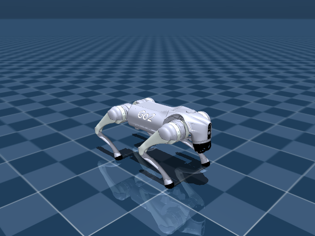

# Go2 Seminar — 自律ロボット入門

このゼミでは『Introduction to Autonomous Robots』を輪読し、Pythonでロボットの動きを確かめます。実習にはMuJoCoとUnitree Go2のモデルを使います。

10月2日は各自のWindows・Macに実習環境を用意します。Go2を画面に表示し、位置や姿勢を読み取ったり、簡単な操作を試したりします。その後、7回にわたって座標系、センサ、経路計画などを扱います。



## はじめに

教材をダウンロードしたら、[Windows](docs/setup-windows.md)または[macOS](docs/setup-macos.md)の手順に沿ってセットアップしてください。当日は[初回の確認項目](docs/day0.md)を使って、各自のPCで動作を確認します。

教科書のPDFは授業で別途配布します。[読む範囲](materials/textbook/README.md)と[ゼミの進め方](docs/student-guide.md)にも目を通しておいてください。

毎回の提出物はありません。実習で分かったことや疑問点は、授業中に話し合います。

## 教材のダウンロード

GitHubの **Code → Download ZIP** からダウンロードし、ZIPを展開してください。中に `README.md`、`scripts`、`examples` があるフォルダを使います。

Gitを使う場合は、次のコマンドでも取得できます。

```text
git clone https://github.com/utiyama/go2-seminar.git
cd go2-seminar
```

MacでGitが見つからないと表示される場合は、[Command Line Toolsの参照先を確認する手順](docs/troubleshooting.md#macでgitが見つからない場合)を参照してください。

リポジトリは非公開です。GitHubで教員からの招待を承認してからアクセスしてください。GitHubを使わない人には、教材のZIPを配布します。

## 実習に使う環境

Python 3.11の64 bit版を使います。対応するPCはWindows x86-64とMac（Apple Silicon / Intel）です。Windows ARMは対象外です。

必要なソフトはセットアップ手順にまとめています。ROS 2やUnitree SDK、専用GPU、実機は使いません。初回はPyPIとGitHubからファイルを取得するため、インターネット接続が必要です。画面表示にはOpenGL対応の描画環境が必要です。

Windows・macOS・Linuxで、セットアップと画面を表示しない実行を確認しています。画面表示は各自のPCでも確認してください。WindowsとIntel Macの実機での画面表示は未確認です。

## 日程

日付は2026年です。各回のページに読む範囲と実習の説明があります。

| 回 | 日付 | 内容 |
|---|---|---|
| 初回 | 10/2 | [セットアップと動作確認](docs/day0.md) |
| 01 | 10/9 | [自律ロボット・状態と行動](exercises/week01/README.md) |
| 02 | 10/23 | [座標系と姿勢](exercises/week02/README.md) |
| 03 | 10/30 | [センサとノイズ](exercises/week03/README.md) |
| 04 | 11/6 | [反応型制御と状態遷移](exercises/week04/README.md) |
| 05 | 11/13 | [地図の作成](exercises/week05/README.md) |
| 06 | 11/20 | [経路計画](exercises/week06/README.md) |
| 07 | 11/27 | [自己位置推定とセンサ融合](exercises/week07/README.md) |

## シミュレータについて

実習では、次の2つのモードを使い分けます。

| モード | 用途 | 計算の方法 |
|---|---|---|
| `physics`（既定） | 立位、関節操作、IMUの値の取得 | 重力や接触を含めてMuJoCoで計算します。歩行制御器は入っていません。 |
| `kinematic` | 平面移動、座標変換、距離の取得 | 胴体の位置を直接更新します。脚は歩かず、障害物に触れても自動では止まりません。 |

例えば、平面上を前進させるコードは次のように書けます。

```python
from go2_seminar import Go2Sim

robot = Go2Sim("kinematic")
robot.set_velocity(vx=0.2, vy=0.0, yaw_rate=0.0)
robot.step(1.0)  # シミュレーション内で1秒進める
print(robot.get_pose().position)  # world座標、単位m
robot.stop()
```

物理モードで関節を動かすときは `set_joint_targets()` を使います。座標系や単位、各関数の説明は[APIと設計](docs/architecture.md)を参照してください。

## 主なファイル

| フォルダ | 内容 |
|---|---|
| `examples/` | 初回に使うサンプル |
| `exercises/week01/` ～ `week07/` | 各回の説明、実習コード、自分用のメモ `notes.md`（任意） |
| `results/` | 実行結果のCSVや画像。同名のファイルは再実行時に上書きされます |
| `docs/` | セットアップ手順、ゼミの進め方、APIの説明 |
| `materials/textbook/` | 教科書の案内と読む範囲 |
| `src/go2_seminar/` | シミュレータを操作する共通コード |

エラーが出たときは[トラブル対処](docs/troubleshooting.md)を参照してください。

## ライセンス

教材として作成したコードと説明文のライセンスは[MIT License](LICENSE)です。教科書原稿、Go2モデル、依存ソフトには、それぞれのライセンスが適用されます。詳しくは[第三者ライセンス](THIRD_PARTY_NOTICES.md)を参照してください。

Go2モデルは[MuJoCo Menagerie](https://github.com/google-deepmind/mujoco_menagerie)から初回実行時に取得します。
