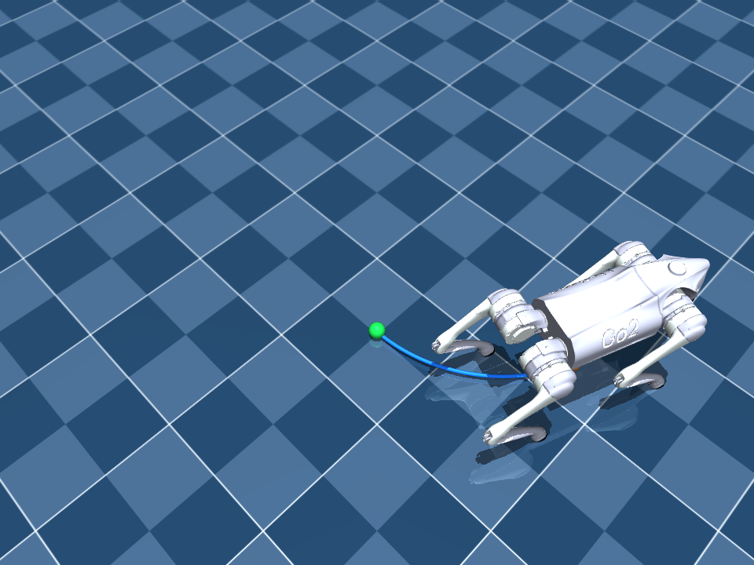

# 第1回　自律ロボット：状態と行動

2026年10月9日

教科書：1.1–1.4、2.1–2.2（抜粋版 3–11ページ）

[教科書の案内](../../materials/textbook/README.md) ／ [ゼミの進め方](../../docs/student-guide.md)

速度の指令を変えて、ロボットの軌跡がどう変わるか調べます。今回は胴体の位置を直接更新する平面移動モードを使います。

## 実行方法

教材の `README.md` があるフォルダから実行します。

macOS:

```bash
bash scripts/run.sh exercises/week01/starter.py --viewer
```

Windows:

```powershell
powershell -NoProfile -ExecutionPolicy Bypass -File .\scripts\run.ps1 exercises/week01/starter.py --viewer
```

Go2が4秒間、前進しながら左に曲がり、その後2秒間停止します。床の青い線が通った軌跡、緑の点が出発位置、オレンジの点が現在位置です。



動作が終わっても画面は開いたままです。左ドラッグで視点を回転し、スクロールで拡大・縮小できます。上から見ると曲がり方が分かりやすくなります。確認が済んだらウィンドウを閉じてください。

数値は `results/week01.csv` に保存されます。ウィンドウを閉じると `results/week01.png` も作られるので、画像として開いてください。左は上から見た軌跡とロボットの向き、右は位置と向きの時間変化です。4秒以降のグラフが水平になるのは、ロボットが停止しているためです。

画面を使わずにCSVと図だけ作る場合は、`--viewer` を `--headless` に変えます。途中でウィンドウを閉じた場合は、その時点までの結果を保存します。再実行すると同名の結果ファイルを上書きするので、比較したい結果は先にコピーしてください。

## すでに保存したCSVを見る

前に作った `results/week01.csv` も再生できます。元のCSVは変更されません。

macOS:

```bash
bash scripts/run.sh examples/06_replay.py results/week01.csv --viewer
```

Windows:

```powershell
powershell -NoProfile -ExecutionPolicy Bypass -File .\scripts\run.ps1 examples/06_replay.py results/week01.csv --viewer
```

CSVに記録された時刻に沿って、位置（x・y）と向き（yaw）を再生します。`results/week01_replay.png` に軌跡の図も保存します。別の実行結果を見るときは、コマンド中のCSVの名前を変えてください。この再生は平面移動モードのログ用です。CSVには脚の関節角が入っていないため、脚の姿勢は固定して表示します。

## 実習

まず画面でGo2の動きを確認してから、速度の指令を変えてみてください。コマンドの末尾に次の指定を追加すると、コードを編集せずに試せます。

| 指定 | 動き |
|---|---|
| `--yaw-rate 0` | まっすぐ前進 |
| `--vx 0 --vy 0.15 --yaw-rate 0` | 向きを変えずに左へ移動 |
| `--vx 0 --yaw-rate 0.3` | その場で左旋回 |
| `--seconds 2` | 移動時間を2秒に変更。その後の停止は2秒 |

`--vx` と `--vy` はロボットから見た前方・左方向の速度（m/s）、`--yaw-rate` は左旋回の角速度（rad/s）です。`starter.py` の `default=` の値を変えても構いません。

1. 前進・横移動・旋回の速度や動かす時間を変え、終点を予想してから実行してください。
2. 予想した動きと画面上の動き、保存された図を比べてください。向きが変わると、同じ前進指令でも軌跡が変わることに注目します。正確な数値を見たいときはCSVを使ってください。
3. 停止後の2秒間は位置が変わらないことを、画面とグラフで確かめてください。

この回では胴体の平面移動を扱います。脚の歩行や、障害物にぶつかったときの動きは計算していません。

実習の結果や疑問点は授業中に話し合います。提出物はありません。
